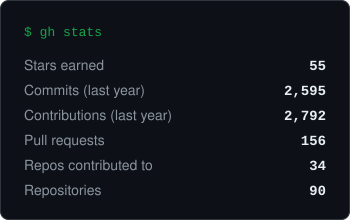
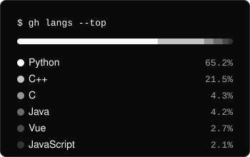

### 👋 Hi, I'm Suho

- 🧪 Building **compilers and languages for ML** — [PPy](https://github.com/franknoh/PPy) (Python → LLVM / CUDA / StableHLO) and [Linnet](https://github.com/franknoh/Linnet) (a typed tensor language)
- ⚡ Writing **GPU kernels** in CUDA, Triton, and Vulkan compute; researching GPU graph DBMS at POSTECH DBLab
- 🤖 Deep learning, RL, and LLM agents as CSO at [Algorix](https://algorix.io)
- 🚩 CTF with **POSTECH PLUS** — DEF CON CTF 34 Finals, 4th

### 🛠️ Stack

### 📈 Activity

